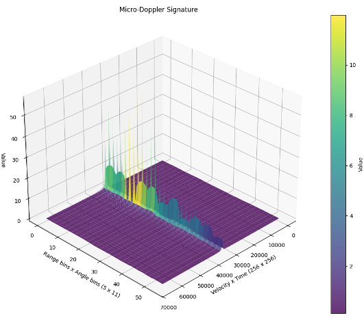
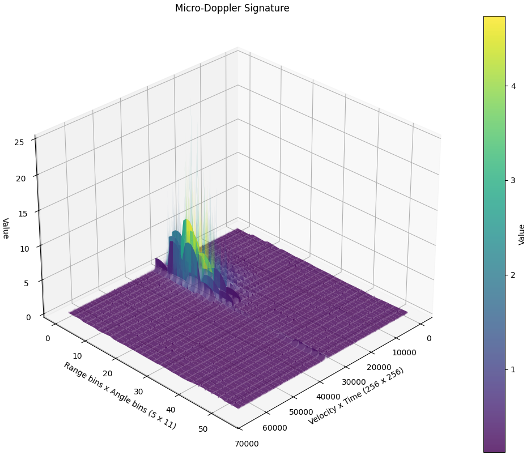
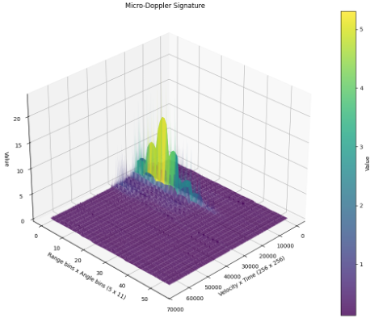

# Temporal-MDS-ViT-Classification

This project proposed Temporal-MDS-ViT applying for the multiclass targets classification: `car, perdestrian, bicycle`

  
  
  

The code is splitted into 2 parts
- Simulate MDS data at `matlab` folder
- Training and Evaluating at `ml` folder

